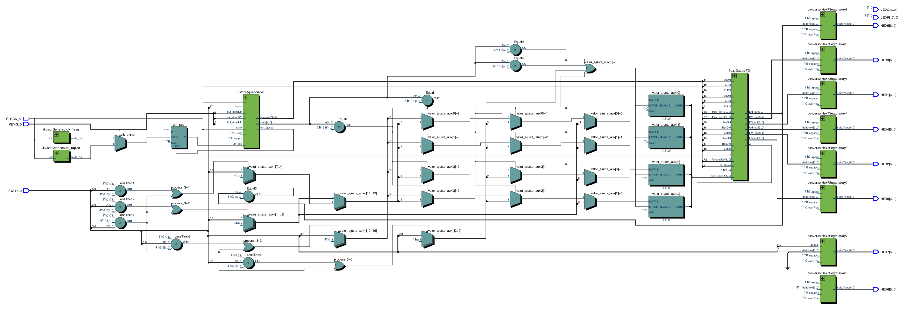
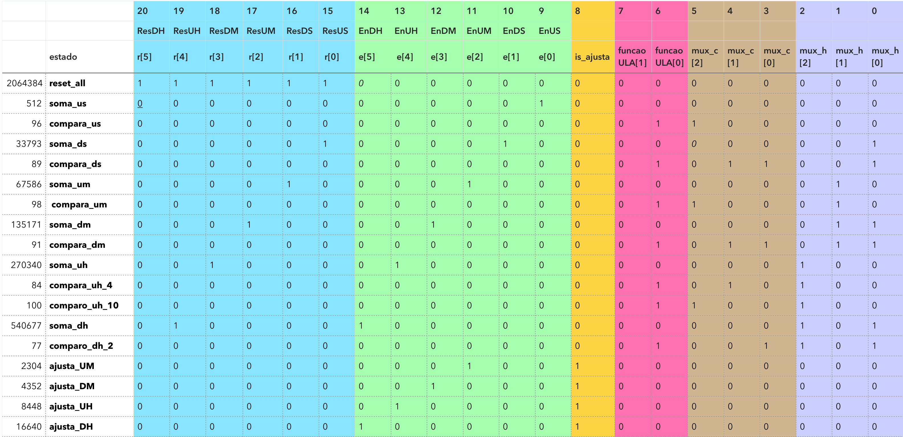
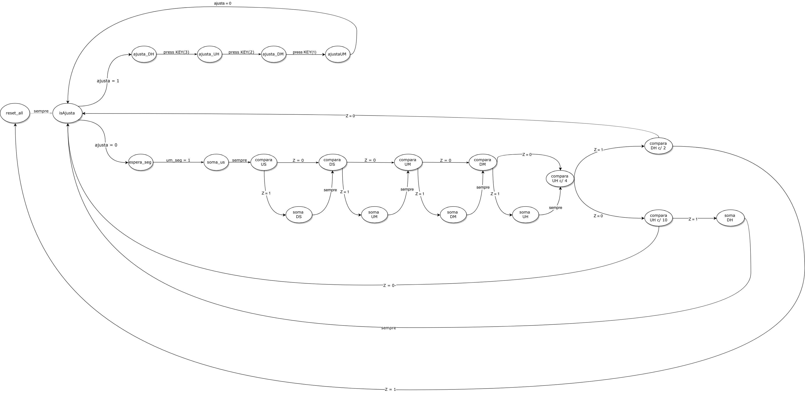
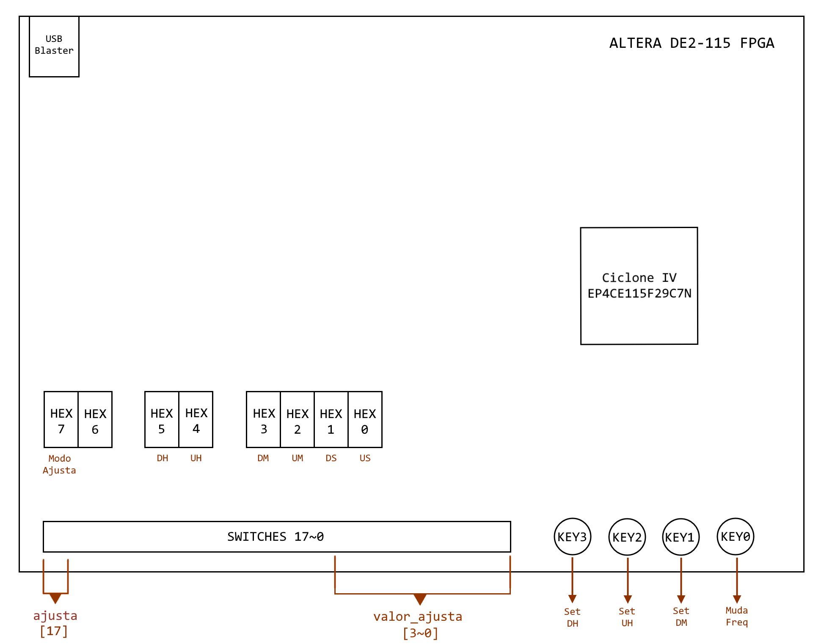

# Relógio Digital
Raphael Costa, Bruna Kimura, Elisa Malzoni, Frederico Curti

## Objetivo do Projeto
Esse projeto teve como objetivo a construção de um relógio digital usando uma
FPGA, capaz de indicar o horário (hora, minutos e segundos), ajustá-lo e alterar a base
de tempo, de forma a acelerar a passagem do tempo para demonstrar rapidamente o
funcionamento do relógio ao longo de um dia. O​ projeto foi escrito na linguagem VHDL
(​VHSIC​ Hardware Description Language), com a IDE Quartus Prime da Intel™.
Diagrama de blocos e funcionamento do circuito
O diagrama de blocos exibido abaixo foi gerado pela ferramenta ​ RTL Viewer disponível
no Quartus. Por ser bastante complexo, fica difícil a visualização, portanto, [​clique aqui](./img/rtlrelogio.pdf) para abrir a imagem em alta definição.

Figura 1 ​ - Diagrama RTL   

O funcionamento do circuito pode ser dividido em duas unidades fundamentais: A unidade
de controle e o fluxo de dados. A unidade de controle é responsável por gerenciar todos
os pontos de controle disponíveis no fluxo de dados, executando uma lógica mínima para
o funcionamento adequado. Nesse projeto, a unidade de controle é a máquina de estados
descrita na Figura 3, disponível na próxima seção. Essa máquina de estados contém para
cada estado uma saída que é a junção de todos os bits necessários para operar os
pontos de controle. Tais estados são descritos pela Figura 2, disponível na página
seguinte. Em ​azul ​estão os bits que descrevem o reset dos registradores que armazenam

as variáveis de contagem da hora e fazem seu display (DH, UH, DM, etc...). Em verde​
estão os bits que descrevem o ENABLE desses mesmos registradores, permitindo a
escrita e atualizando o valor armazenado para os valores de entrada provenientes da ULA
ou do Input de Ajuste. Em ​amarelo ​está o bit que controla um mux para determinar se o
valor que chegará à entrada dos registradores será proveniente da ULA ou do Input de
Ajuste. Em ​rosa estão​ os bits que descrevem qual a operação que a ULA deve fazer
(soma ou subtração para esse projeto, com um overhead para outras operações). Em
marrom estão​ os 3 bits necessários para o seletor do MUX que guarda as constantes
necessárias para as comparações e operações aritméticas do relógio. Por fim, em ​roxo
estão os bits necessários para o seletor da ULA que indica qual variável do horário será
modificada.

Figura 2 ​ - Tabela dos bits que descrevem cada saída da máquina de estados

## Diagrama de estados
A mudança dos estados do projeto é determinada pela saída Z da ULA do fluxo de
dados. Essa saída indica quando o resultado de alguma operação for zero, o que em uma
subtração também indica que os valores de entrada na ULA são iguais. Isso permite que
seja possível comparar o número atual de cada campo do horário com uma constante
pré-definida, e assim saber quando resetar o valor desse campo e incrementar o valor do
campo seguinte. Um processo mais delicado ocorre no final de toda a máquina de
estados para o valor limite de 23:59:59, caso no qual toda a máquina de estados é
resetada (estado reset_all)
Por ser bastante detalhado, fica difícil a visualização do diagrama de estados, portanto,
[clique aqui](./img/estados.png) para abrir em alta definição.

Figura 3 ​ - Diagrama de Estados

## Guia do usuário

Figura 4 ​ - Representação externa da FPGA

Quando ligado, o relógio irá apresentar nos displays de 7 segmentos (HEX 7~0) o horário inicial
(00:00:00).
Para acelerar a passagem de tempo, basta segurar o botão KEY 0.
Para ajustar a hora, o usuário precisa levantar o SWITCH 17, no canto inferior esquerdo da
placa, iniciando o modo de Ajuste. Para indicar que o modo de Ajuste está selecionado, o
display HEX 7 irá exibir a letra A ​.​ Nesse modo, o ajuste do horário é feito escrevendo o valor
desejado para cada campo do horário em binário, através dos 4 SWITCHES do lado direito
(3~0). O campo a ser modificado começa pela Dezena da Hora (DH). Para aplicar o valor
selecionado pelos switches e passar para o próximo campo (UH), é necessário pressionar o

botão KEY 3. Já para a Unidade da Hora (UH), usa-se o botão KEY 2 para aplicar o novo valor
e passar para o próximo campo. Para a Dezena do Minuto é o mesmo processo, porém
apertando o botão KEY 1. Por fim, para aplicar o novo valor ao campo da Unidade do Minuto,
basta descer o SWITCH 17, saindo do modo Ajusta e voltando à operação normal do relógio, a
partir do novo horário. Existe uma limitação na qual sempre que o usuário entrar no modo
Ajuste, ele deve passar por todas essas etapas para poder voltar à operação normal, mesmo
que não faça nenhuma modificação.
O horário é exibido nos displays de 7 segmentos de acordo com a tabela abaixo:

|Valor|Componente|
|-|-|
|Dezena da Hora| (DH) HEX 5|
|Unidade da Hora| (UH) HEX 4|
|Dezena do Minuto| (DM) HEX 3|
|Unidade do Minuto| (UM) HEX 2|
|Dezena do Segundo |(DS) HEX 1|
|Unidade do Segundo |(US) HEX 0|

Tabela 1 ​- Relação entre os campos do horário e o componente de exibição
